<div align="center">


# NSBMunch

### Campus Food Ordering Mobile App with Scheduled Auto Pay

[](https://flutter.dev)
[](https://firebase.google.com)
[](https://dart.dev)

> PUSL2021 Computing Group Project | Group 86  
> NSBM Green University — Campus Food Ordering System with Automated Scheduled Payments

</div>

---

## About

NSBMunch is a cross-platform mobile application built for the NSBM Green University community. It solves the daily problem of long canteen queues by allowing students and staff to browse menus, place immediate orders, and schedule food orders in advance with automatic payment triggering — so students never miss a meal during busy exam periods.

The app was built using Flutter and a Firebase cloud backend, serving three distinct user roles: students and staff, canteen vendors, and administrators.

---

## Key Features

**For Students and Staff**
- Browse menus from all campus canteens with category filtering and keyword search
- Add items from multiple canteens to a single cart
- Place immediate orders with pickup time selection
- Scheduled Auto Pay — plan meals days in advance; Firebase Cloud Functions automatically activate orders at the set time
- Real-time order status tracking with push notifications
- Save payment card details for quick checkout

**For Canteen Vendors**
- Real-time incoming order alerts with sound and visual notifications
- Full menu management — add, edit, remove items, upload photos, toggle availability
- Step-by-step order status updates (Pending to Preparing to Ready to Completed)
- Register bank account details for payment receiving
- Daily sales analytics dashboard showing revenue, order counts, and best sellers

**For Administrators**
- Review and approve or reject vendor registration requests in real time
- Manage vendor status across Pending, Approved, and Rejected categories
- Revoke vendor approval when needed

---

## The Scheduled Auto Pay System

The most innovative feature of NSBMunch. Students can select food items, choose a future pickup date and time, and set a separate auto payment trigger time. On confirmation, the system handles everything automatically.

At the designated trigger time, Firebase Cloud Functions activate the order, generate a unique order number, notify the canteen vendor, and send a confirmation notification to the student — with no manual action required from the user.

---

## Screenshots

**Authentication**

| Login | Student Registration | Vendor Registration |
|-------|---------------------|---------------------|
| 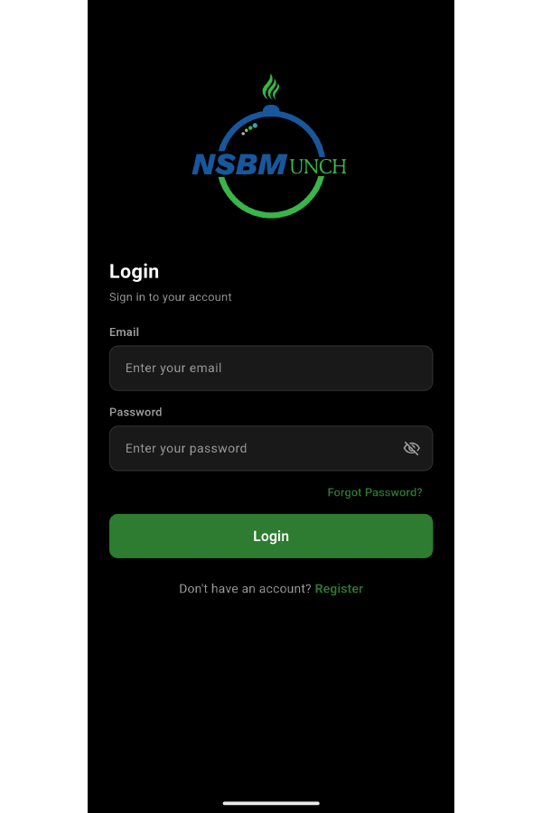 | 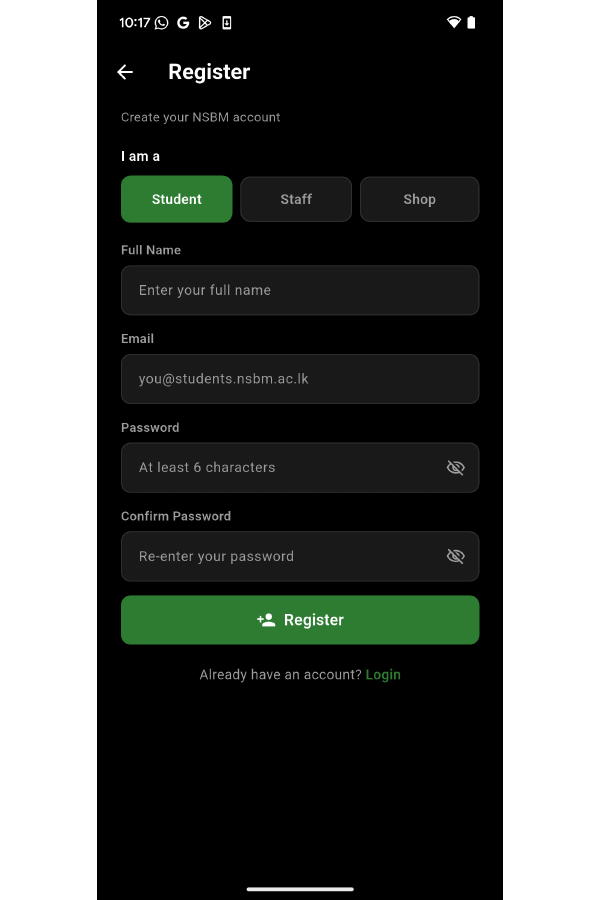 | 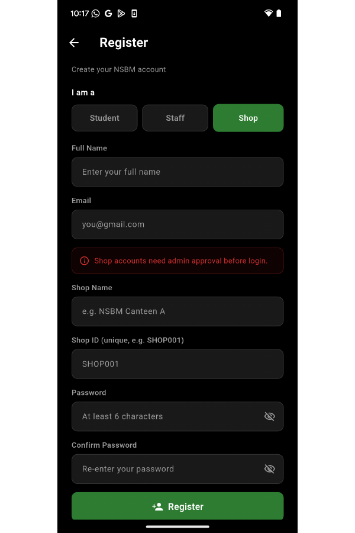 |

**Admin Panel**

| Pending Requests | Approved Vendors | Rejected Vendor |
|-----------------|-----------------|----------------|
| 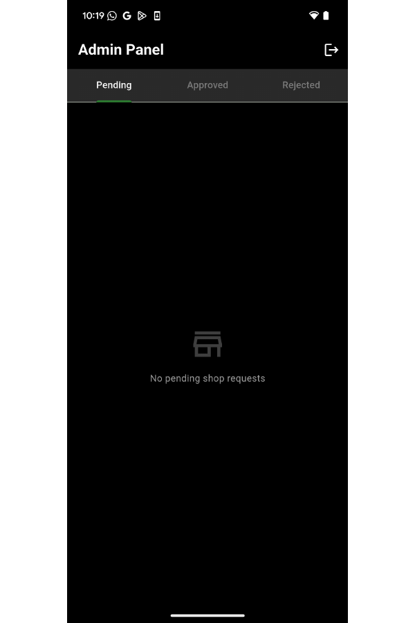 | 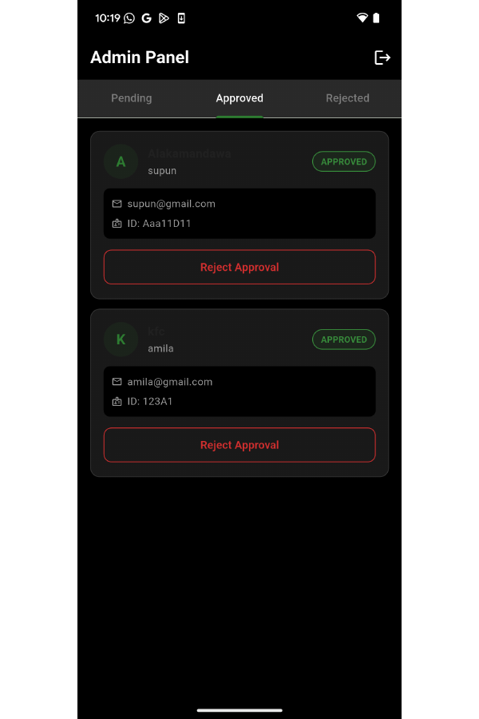 | 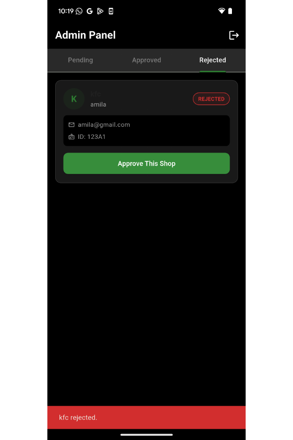 |

**Vendor**

| Incoming Orders | Add Menu Item | Menu Management |
|----------------|--------------|----------------|
| 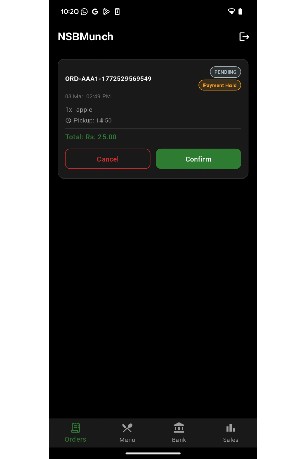 | 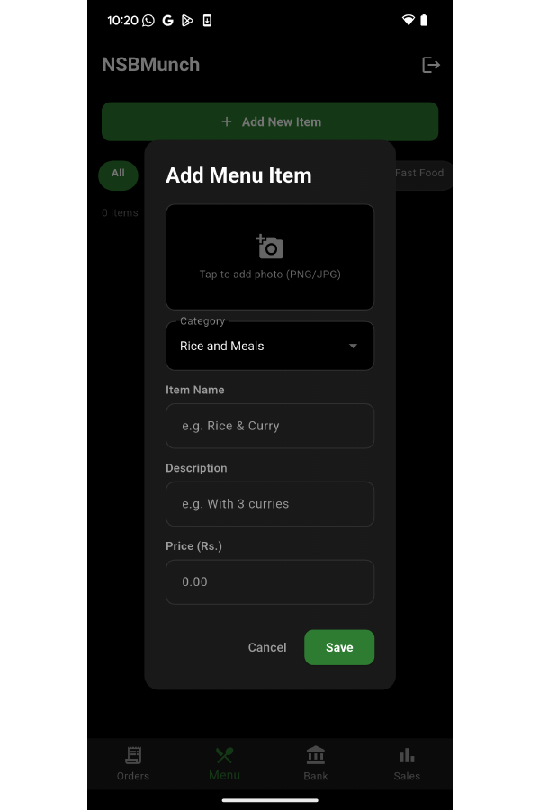 | 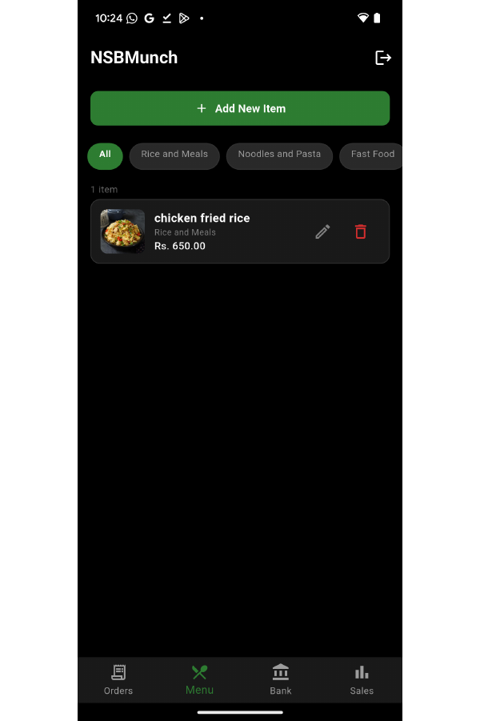 |

| Bank Account | Sales Dashboard |
|-------------|----------------|
| 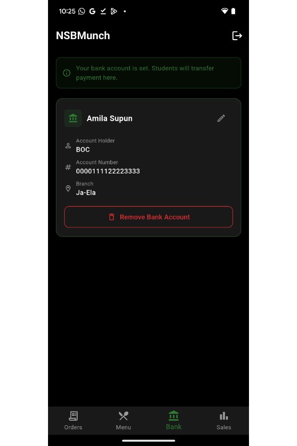 | 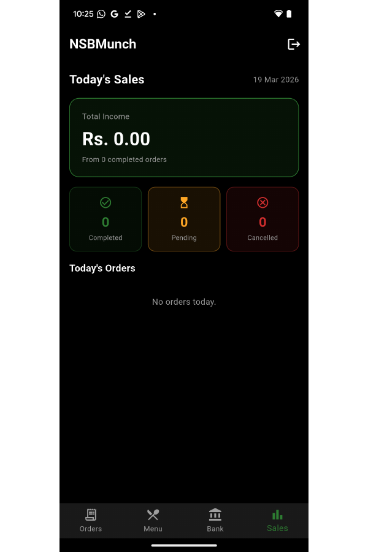 |

**Student**

| Browse Food | Quick Orders | Scheduled Orders |
|------------|-------------|-----------------|
| 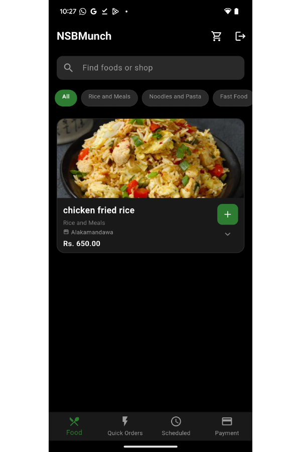 | 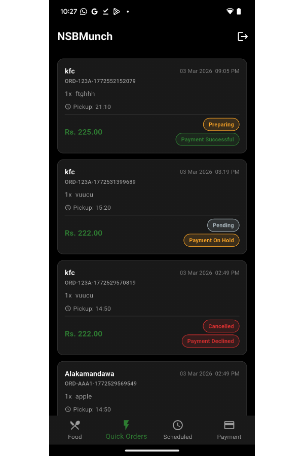 | 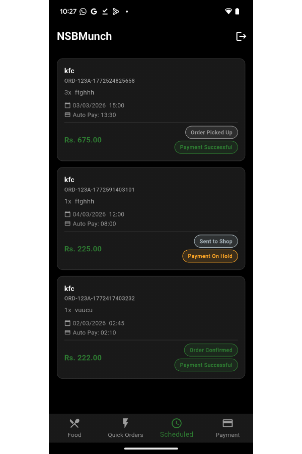 |

| Payment Details | Cart | Check Order | Schedule Order |
|----------------|------|-------------|---------------|
| 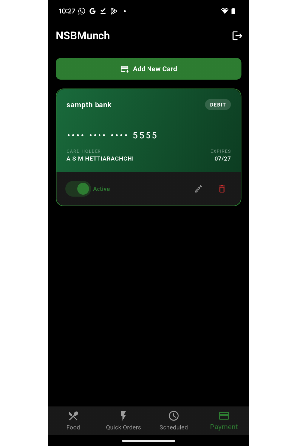 | 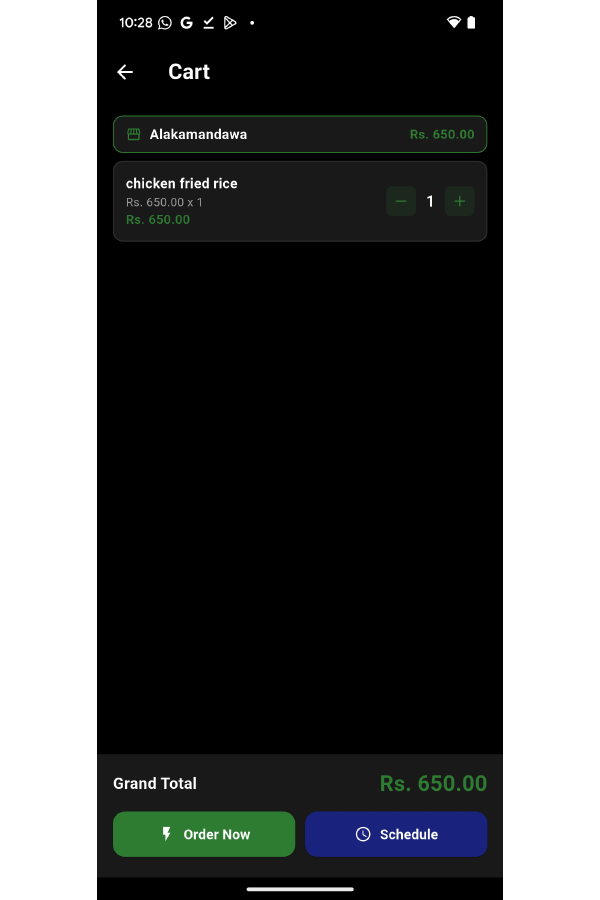 | 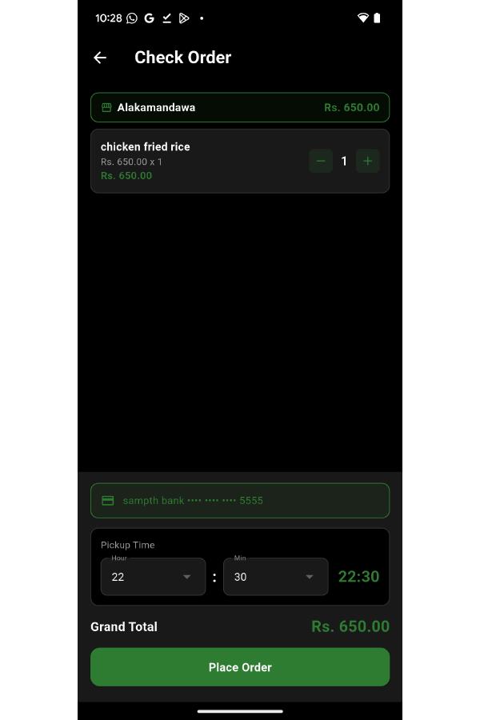 | 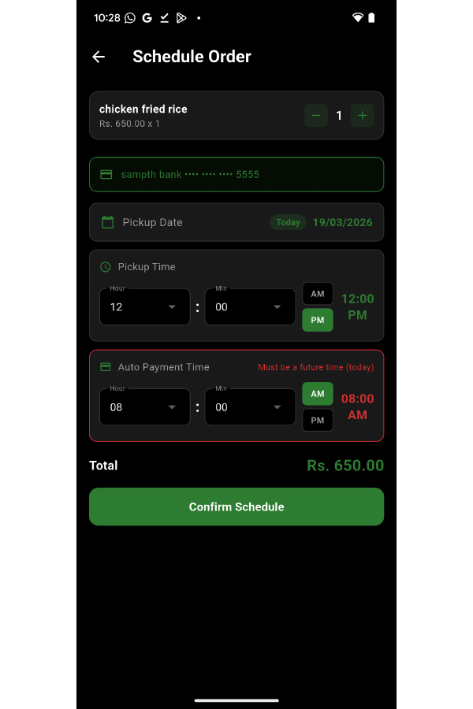 |

---

## Tech Stack

| Layer | Technology | Purpose |
|-------|-----------|---------|
| Frontend | Flutter 3.9.2 | Cross-platform UI for Android and iOS |
| Backend | Firebase Cloud Functions (Node.js) | Scheduled order execution, notifications |
| Database | Firebase Firestore | Real-time NoSQL data sync |
| Auth | Firebase Authentication | Email/password login, role assignment |
| Notifications | Firebase Cloud Messaging | Push notifications |
| Storage | Firebase Storage | Vendor food item images |
| Payment | Firestore (bank transfer model) | Vendor bank accounts, student card details |

---

## Installation and Setup

### Prerequisites
- Flutter SDK 3.x
- Android Studio or Visual Studio Code with Flutter and Dart extensions
- Node.js for Firebase Cloud Functions
- Android device or emulator (Android 8.0+)
- Firebase project with Firestore, Auth, Storage, and FCM enabled

### Steps

```bash
# 1. Clone the repository
git clone https://github.com/amilasupun/NSBMunch.git
cd NSBMunch

# 2. Install Flutter dependencies
flutter pub get

# 3. Configure Firebase
# Add your google-services.json to /android/app/
# Add your GoogleService-Info.plist to /ios/Runner/

# 4. Deploy Cloud Functions
cd functions
npm install
firebase deploy --only functions

# 5. Run the app
flutter run
```

### Firebase Setup
1. Create a Firebase project at [console.firebase.google.com](https://console.firebase.google.com)
2. Enable Authentication (Email/Password and Google)
3. Create a Firestore database
4. Enable Firebase Storage
5. Enable Firebase Cloud Messaging
6. Deploy Firestore security rules from `firestore.rules`

---

## Project Structure

```
NSBMunch/
├── lib/
│   ├── models/          # Data models (FoodOrder, MenuItem, ScheduledOrder...)
│   ├── screens/
│   │   ├── student/     # Browse, Cart, Orders, Schedule, Payment
│   │   ├── vendor/      # Orders, Menu, Bank Account, Sales
│   │   └── admin/       # Vendor approval panel
│   ├── services/        # AuthService, OrderService, NotificationService...
│   └── main.dart
├── functions/           # Firebase Cloud Functions (Node.js)
├── assets/
│   └── icons/
├── android/
├── ios/
└── pubspec.yaml
```

---

## Team — Group 86

| Name | Student ID | Responsibilities |
|------|-----------|-----------------|
| Medagama Gunarathna | 10967150 | Project Lead, System Testing, Documentation |
| Amila Hettiarachchi | 10967157 | User Authentication Module (Login, Register, AuthService) |
| Lekam Hasaranga | 10967152 | Flutter UI Implementation across multiple screens |
| Andrew Jansen | 10967084 | Cloud Functions, Payment Model, Bank Account Management |
| Kosgallana Gunasingha | 10967151 | Vendor Dashboard, Menu Management, Image Upload |
| Gunawardana Gunawardana | 10967304 | Firebase Backend, Scheduled Auto-Pay, Push Notifications, Real-time Order Tracking |
| Isuli Dadigama | 10967196 | Shopping Cart, Food Browsing, Category Filtering and Search |
| Isira Piyarathna | 10967191 | Firestore Database Schema, Data Models, Security Rules |
| Ranthati Rathnasiri | 10967197 | Dashboard UI Design, Admin Panel, Sales Screen |

---

## User Roles and Access

| Role | Email | Access |
|------|-------|--------|
| Student | @students.nsbm.ac.lk | Browse, Order, Schedule, Track |
| Staff | @nsbm.ac.lk | Same as Student |
| Vendor | Any email | Menu, Orders, Bank, Sales (requires admin approval) |
| Admin | Hardcoded credentials | Vendor approval management |

---

## Testing

All features were tested on physical Android devices using `flutter run` in Visual Studio Code.

| Test Area | Platform | Result |
|-----------|---------|--------|
| User Registration and Email Domain Validation | Android | Pass |
| Scheduled Auto Pay Execution | Android | Pass |
| Real-time Push Notifications (FCM) | Android | Pass |
| Vendor Order Management | Android | Pass |
| Admin Vendor Approval | Android | Pass |
| Firestore Security Rules | Firebase Console | Pass |
| Network Disconnection Handling | Android | Pass |
| iOS Build Compilation | iOS (build only) | Pass — runtime not tested |

---

## References

- Taylor, S. (2020). Campus dining goes mobile. *Journal of Foodservice Business Research*, 24(2), 121–139.
- Hamid et al. (2022). E-Runner: a mobile application for campus food delivery service. *Journal of Computing Research and Innovation*, 7(2), 357–365.
- [Flutter Documentation](https://flutter.dev/docs)
- [Firebase Documentation](https://firebase.google.com/docs/flutter/setup)

---

## Module Information

| | |
|-|-|
| Module | PUSL2021 Computing Group Project (25/AY/AU/M) |
| Supervisor | Ms. Sanuli Weerasinghe |
| Programme | SE / CS / DS / TM |
| University | NSBM Green University (In Partnership with Plymouth University) |
| Group | Group 86 |

---

<div align="center">
Made with care by Group 86 — NSBM Green University
</div>